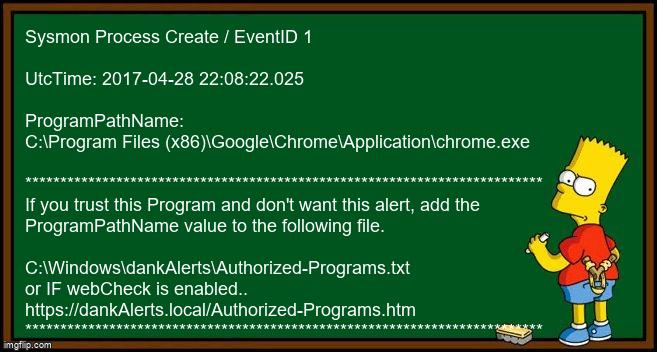
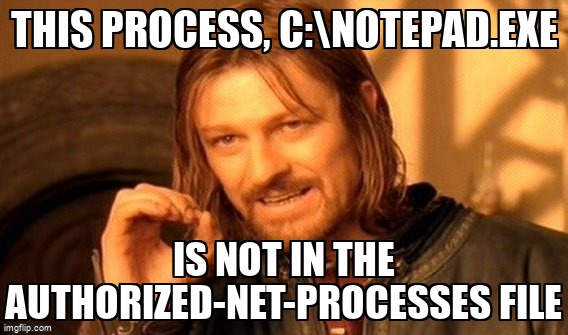

**dankAlerts is powered by Sysmon and Memes. Would you notice if a suspicious process was recorded in the Windows event logs?**

June 2020

This is an actively supported project.  Please create an issue if you have any questions!

dankAlerts is a fun way to learn about computer security, how Microsoft Windows program events are logged, and how to use these logs to alert you of previously unknown behavior that may be suspicious.

dankAlerts is powered by Sysmon and Memes. dankAlerts presents anomalies to you in text written into meme images and guides you in order to reduce false positives.  



Alpha/Beta software

**Setup instructions**

1- Install and configure Sysmon.

There are several guides online. These are both solid guides.

https://community.sophos.com/kb/en-us/134205

https://www.blackhillsinfosec.com/getting-started-with-sysmon/

2- Install Awk for Windows  
**Google -->windows install awk<-- to find the sourceforge.net download site**

This is a very old version of awk for windows and it works perfectly for our needs.

Screenshot of the awk page that will take you to sourceforge https://github.com/firstoctet/dankAlerts/blob/master/awk1.PNG

3- If you don't want to use our pyinstaller created exe file (dankAlertMemGenerator.exe) install the following
  - python3 and pip
  - pip install pillow
  - pip install pyinstaller
  - Generate your own exe by running pyinstaller --onefile .\dankAlertMemGenerator.py

4- Copy dankAlertMemGenerator.exe to C:\Windows\dankAlerts\

Be sure to modify dankAlerts.ps1 if you decide to use a different path.

5- Run dankAlerts.ps1 as Administrator.  This is required to read the Sysmon event logs.



**FYI**

Minutes, Seconds and Milliseconds are stripped out in order to DRASTICALLY reduce the number of alerts. No need to alert for the same event multiple times in 1 hour. Note the awk line --> $1\":MM?:SS?\" below

```
$Sysmon3 = wevtutil.exe qe Microsoft-Windows-Sysmon/Operational /q:"*[System[(EventID=3) and TimeCreated[timediff(@SystemTime) <= 369900]]]" | 
ForEach-Object {$_ -replace '<', "`n"} | findstr /i "timecreated image" | 
   awk -F ":" '{if ($0 ~ /TimeCreated/) {printf $1\":MM?:SS?\"} else {print \"~\",$0}}' | 
   Sort-Object | Get-Unique
```
**Todo**

Add more wevtutil.exe queries  
Add support for this! https://github.com/Neo23x0/sigma

Add WebCheck support for https://dankAlerts.local/Authorized-Programs.htm

Add support for Alerts from other systems sent via Base64encoded get requests to a python HTTPS enabled SimpleHTTPServer module. 
This method is used to strictly limit write access between systems.
